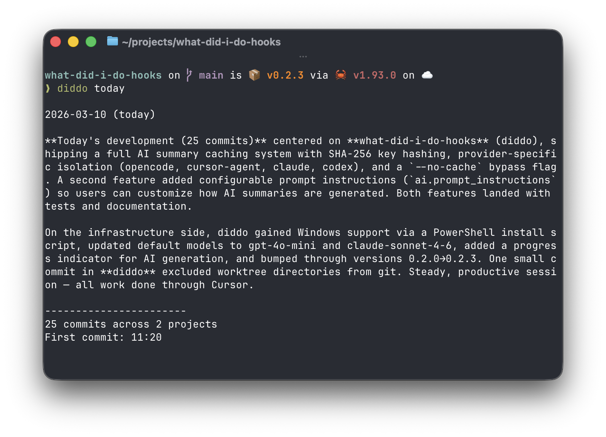

# diddo

`diddo` tracks your git commits and turns them into daily summaries.

It installs a global `post-commit` hook, stores commit metadata in a local SQLite database, and can summarize that history with an AI CLI tool or a direct API provider.



## Install

Supported platforms: **macOS** (Apple Silicon, Intel), **Linux** (x86_64, aarch64), **Windows** (x86_64, ARM64). Pre-built binaries are published for each [release](https://github.com/drugoi/diddo-hooks/releases). Pre-built Linux binaries are built on Ubuntu 22.04 and require **glibc 2.35+** (e.g. Ubuntu 22.04 or Debian 12). On older distros, install from source: `cargo install --path .`.

### Homebrew (macOS & Linux)

If you use [Homebrew](https://brew.sh):

```bash
brew tap drugoi/tap
brew install diddo
```

### macOS and Linux

Install the latest release:

```bash
curl -sSL https://raw.githubusercontent.com/drugoi/diddo-hooks/main/install.sh | sh
```

To pin a version:

```bash
DIDDO_VERSION=0.1.0 curl -sSL https://raw.githubusercontent.com/drugoi/diddo-hooks/main/install.sh | sh
```

### Windows (PowerShell)

Install the latest release (run PowerShell as current user):

```powershell
irm https://raw.githubusercontent.com/drugoi/diddo-hooks/main/install.ps1 | iex
```

To pin a version:

```powershell
$env:DIDDO_VERSION = "0.1.0"; irm https://raw.githubusercontent.com/drugoi/diddo-hooks/main/install.ps1 | iex
```

Install options (environment variables):

- **DIDDO_VERSION** — Pin the install to a specific release (e.g. `0.1.0`).
- **DIDDO_INSTALL_DIR** — Directory where the binary is installed. Defaults: `$HOME/.local/bin` (macOS/Linux), `%LOCALAPPDATA%\diddo` (Windows).

Alternatively, download the `diddo-<version>-x86_64-pc-windows-msvc.zip` (or ARM64) from [Releases](https://github.com/drugoi/diddo-hooks/releases), extract `diddo.exe`, and add the folder to your PATH.

### From source (all platforms)

```bash
cargo install --path .
```

To try without installing:

```bash
cargo run -- --help
```

## Setup

Install the managed global hooks directory:

```bash
diddo init
```

What `diddo init` does:

- Creates a managed hooks directory for `diddo`
- Sets global git `core.hooksPath` to that directory
- Preserves and forwards any previously configured global hooks so existing hooks keep running

On **Windows**, global hooks run only if you use **Git for Windows** (or another Git that runs hook scripts with a Unix-like shell). The generated hooks are `#!/bin/sh` scripts; Git for Windows runs them with its bundled sh.

### Repositories with local hooks (Husky, etc.)

Repositories that set a local `core.hooksPath` (e.g. Husky’s `.husky`) override the global path. Git only runs hooks from the local directory, so the global hooks are never invoked.

Run `diddo init` from within such a repo to add a `post-commit` hook to the local hooks directory. This ensures commits are recorded:

```bash
cd your-husky-repo
diddo init
```

You’ll see:

```text
Installed diddo hooks in ... and updated global core.hooksPath.
Also added diddo post-commit to this repo's local hooks (.husky) so commits are recorded.
```

If a `post-commit` already exists in that directory, it is backed up as `post-commit.diddo-prev` and the new script chains to it.

`diddo` only records commits made after setup. It does not backfill old git history into the database.

To see where `diddo` stores its config, database, and managed hooks on your machine:

```bash
diddo config
```

Example output:

**macOS:**

```text
Config file: /Users/you/Library/Application Support/diddo/config.toml
Database path: /Users/you/Library/Application Support/diddo/commits.db
Hooks dir: /Users/you/Library/Application Support/diddo/hooks
```

**Linux:**

```text
Config file: /home/you/.config/diddo/config.toml
Database path: /home/you/.local/share/diddo/commits.db
Hooks dir: /home/you/.config/diddo/hooks
```

**Windows:**

```text
Config file: C:\Users\you\AppData\Roaming\diddo\config.toml
Database path: C:\Users\you\AppData\Local\diddo\commits.db
Hooks dir: C:\Users\you\AppData\Roaming\diddo\hooks
```

## Usage

Run `diddo` in a terminal to launch **interactive mode** — an arrow-key menu of all available commands. Any `--` flags without a subcommand (e.g. `diddo --table`, `diddo --md`) also launch interactive mode; the flags are ignored.
Interactive mode includes direct shortcuts for `month` and a `range` form that collects `from` and optional `to` dates in either `YYYY-MM-DD` or `DD.MM.YYYY` before launching the command.

Show summaries:

```bash
diddo today
diddo yesterday
diddo week
diddo month
diddo range --from 2026-03-01
diddo range --from 01.03.2026 --to 11.03.2026
diddo range --from 2026-03-01 --to 2026-03-11
diddo standup
```

Output modes (require a subcommand):

```bash
diddo today --md
diddo today --table
diddo yesterday --json
diddo week --raw
diddo month --md
diddo range --from 2026-03-01 --json
diddo range --from 2026-03-01 --to 2026-03-11 --raw
diddo today --no-cache
diddo yesterday --json
diddo yesterday --table
diddo week --raw
diddo week --table
```

Output flags must be used with a subcommand (`today`, `yesterday`, `week`, `standup`):

- **`--md`** — Output summary as markdown. Includes the repository activity table.
- **`--json`** — Output summary as JSON.
- **`--raw`** — Skip AI and show grouped raw commit data only (no activity table).
- **`--table`** — Skip AI and show only the per-repository activity table.
- **`--no-cache`** — Skip the AI summary cache and force a fresh summary.

Default terminal and markdown summaries include a repository activity table after the AI summary (or raw fallback). The table shows per-repository commit counts and percentages for the selected period:

```text
repository   commits  percentage
-----------  -------  ----------
diddo              5       62.5%
api-service        3       37.5%
-----------  -------  ----------
Total              8      100.0%
```

Use `--table` with a subcommand to skip AI and show only the table:

```bash
diddo today --table
diddo week --table
```

Current CLI behavior:

- `diddo` without a subcommand launches interactive mode in a terminal; any `--` flags are ignored
- `diddo today`, `diddo yesterday`, `diddo week`, `diddo standup` run the corresponding summary directly
- `diddo standup` shows commits from the last 24 hours (`[now - 24h, now]`), useful when your daily meeting is in the afternoon
- `diddo` and `diddo today` are equivalent
- `diddo month` shows the current calendar month from day 1 through today
- `diddo range --from YYYY-MM-DD|DD.MM.YYYY [--to YYYY-MM-DD|DD.MM.YYYY]` shows an inclusive custom date range
- `diddo range --from ...` defaults `--to` to today's local date
- `range` accepts both `YYYY-MM-DD` and `DD.MM.YYYY` on input, and normalizes output labels back to `YYYY-MM-DD`
- Output flags (`--md`, `--json`, `--raw`, `--table`, `--no-cache`) only take effect with a subcommand
- `--table` is mutually exclusive with `--md`, `--json`, and `--raw`
- `--raw` skips AI and shows grouped commit data without the activity table
- `--table` skips AI and shows only the repository activity table
- Default terminal and `--md` summaries include the repository activity table after the AI summary (or raw fallback)
- `--md` and `--json` still try AI first unless you also use `--raw`
- If no commits are recorded for the selected period, `diddo` prints an empty-period message instead of failing

Summaries are grouped by git profile (`user.email`) then by repo; there is one AI summary per profile. Commits with no configured email are grouped under "unknown".

Other commands:

```bash
diddo init
diddo uninstall
diddo config
diddo metadata
diddo update
```

- **`diddo metadata`** — Show database metadata: file size, total commit count, oldest recorded commit, and hooks status (global and local). Use it to verify your setup; it shows hints when something is misconfigured (e.g. `Local hooks: .husky (missing diddo hook — run 'diddo init')`).
- **`diddo update`** — Self-update to the latest release (detects Homebrew vs GitHub install; use `--yes` to skip the confirmation prompt).

## AI Providers

`diddo` is CLI-first by default.

AI summaries are **cached** in the same SQLite database as your commits. When the commit set and period are unchanged (and you use the same provider/model), `diddo` returns the stored summary instead of calling the AI again. Use `--no-cache` to force a fresh summary.

Without extra configuration, it tries installed AI CLIs in this order:

1. `claude`
2. `codex`
3. `opencode`
4. `cursor`

If no supported CLI is available, `diddo` falls back to a direct API provider when configuration and credentials are available.

If neither CLI tools nor a usable API configuration are available, `diddo` falls back to grouped raw commit output and prints a warning on stderr.

### Provider selection rules

- Default behavior: try detected CLI tools first, then try API
- `ai.cli.prefer = "cli"`: keep CLI-first behavior, then API fallback if configured
- `ai.cli.prefer = "claude"`, `"codex"`, `"opencode"`, or `"cursor-agent"`: force that CLI first, then API fallback if configured
- `ai.cli.prefer = "api"`: skip CLI detection and use API only

Supported API providers:

- `openai`
- `anthropic`

Default API models:

- OpenAI: `gpt-4o-mini`
- Anthropic: `claude-sonnet-4-6`

### Default prompt

When `ai.prompt_instructions` is not set (or empty), the CLI uses a built-in prompt. There is no config key for the default; it is fixed in the binary. The prompt sent to the AI is (with `{period}` and commit count/list filled in):

```text
You are summarizing git activity for {period}.

Using only the commit data provided, produce a concise repository-based summary of changes.

Format:

Repository: <repository_name>
1. <short description of change or feature>
2. <short description of fix or improvement>

Repository: <another_repository>
1. <short description of change or feature>
2. <short description of fix or improvement>

Examples:

Repository: diddo
1. Added AI-powered daily summaries for recorded commits.
2. Improved the global hook installation flow.

Repository: api-service
1. Fixed token refresh handling for expired sessions.
2. Refactored request validation for clearer error responses.

Guidelines:
- Group commits by repository.
- Convert commit messages into short, clear descriptions of what changed.
- Combine similar commits into a single bullet when possible.
- Focus on meaningful work (features, fixes, refactors, improvements).
- Ignore trivial commits (formatting, typos, merge commits) unless important.
- Keep each bullet to one short sentence.

Use only the commit data below.

Period: {period}
Commit count: {n}

Commits:
1. [repo_name] message (hash) on branch at 2026-03-10T12:00:00Z; files: 3, +12, -4
...

Return plain text only.
```

`{period}` is e.g. today, yesterday, this week, this month, or a concrete date span like `2026-03-01 to 2026-03-11`; `{n}` is the commit count. The list is one line per commit in the format above.

## Config File

The config file is optional. If it does not exist, `diddo` still works for raw summaries and for AI summaries when a supported CLI tool is already installed.

Run `diddo config` to get the exact config path on your machine.

Options:

| Key | Description |
|-----|-------------|
| `ai.provider` | API provider: `openai` or `anthropic` |
| `ai.api_key` | API key (overrides environment variables) |
| `ai.model` | Model for direct API; defaults: `gpt-4o-mini` (OpenAI), `claude-sonnet-4-6` (Anthropic) |
| `ai.prompt_instructions` | Custom AI instructions (tone, language, length); period and commit list are always appended |
| `ai.cli.prefer` | CLI/API preference: `api`, `cli`, `claude`, `codex`, `opencode`, or `cursor-agent` |
| `filters.ignored_profiles` | List of author emails to exclude from reports. Defaults to `["test@test.com"]`. Set to `[]` to disable filtering. |

Example:

```toml
[ai]
provider = "openai"
model = "gpt-4o-mini"

[ai.cli]
prefer = "cli"
```

To use the direct API fallback, provide credentials either in the config file:

```toml
[ai]
provider = "anthropic"
api_key = "your-api-key"
model = "claude-sonnet-4-6"
prompt_instructions = "Summarize in German. One short paragraph, plain text only."

[ai.cli]
prefer = "cli"
```

or through environment variables:

```bash
export DIDDO_OPENAI_KEY=your-openai-key
export DIDDO_ANTHROPIC_KEY=your-anthropic-key
```

Notes:

- `ai.provider` accepts `openai` or `anthropic`
- `ai.cli.prefer` accepts `api`, `cli`, `claude`, `codex`, `opencode`, or `cursor-agent` (alias: `cursor_agent`)
- `ai.model` applies to direct API providers only; CLI tools use their own default model selection
- `ai.api_key` in the config file overrides environment variables
- `ai.prompt_instructions` (optional): when set, replaces the default AI instructions (tone, language, length); period, commit count, and commit list are always appended. Use for a different language or more concise output. Empty or missing = default instructions.
- If `ai.provider` is omitted and exactly one of `DIDDO_OPENAI_KEY` or `DIDDO_ANTHROPIC_KEY` is set, `diddo` infers the provider from that environment variable
- `filters.ignored_profiles` excludes commits whose author email matches any entry (trimmed, case-insensitive) from summary and activity reports. `test@test.com` is ignored by default; override with a custom list or `[]` to keep everything

Example:

```toml
[filters]
ignored_profiles = ["test@test.com", "ci-bot@example.com"]
```

## Uninstall

Remove `diddo` from your global git hooks setup:

```bash
diddo uninstall
```

Current uninstall behavior:

- Removes the managed `diddo` hooks directory
- Restores the previous global `core.hooksPath` if `diddo` still owns that setting
- Unsets global `core.hooksPath` if `diddo` created it and there was no previous value
- Leaves the current global `core.hooksPath` untouched if you changed it after installing `diddo`
- Does not remove `post-commit` hooks added to local hooks directories (e.g. `.husky`); remove those manually if desired

## License

MIT
